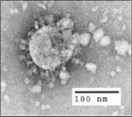
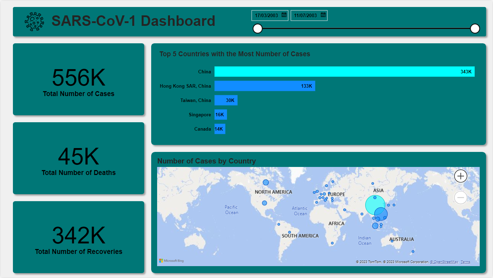

# SARS-CoV Applied Regression Analysis

  

Severe Acute Respiratory Syndrome (SARS) outbreak which happened in 2003 affected many people in different countries. SARS is an airbourne virus that spreads through small droplets of saliva, much like the common cold and influenza virus. It was the first severe and easily transmissible new disease to appear in the twenty-first century, and it had a clear ability to spread through international air travel routes. Due to rise in cases many intervention measures have been launceh to combat the spread of the virus. So by forecasting how many deaths may or have occured and also understanding the number of recovries it can be used to assess the effectiveness of the intervention measures for the SARS outbreak.

The [dataset](https://www.kaggle.com/datasets/imdevskp/sars-outbreak-2003-complete-dataset) is about the number of cases and deaths of people who suffered from the Severe Acute Respiratory Syndrome (SARS) outbreak which happened in 2003 which affected people in different places of the world. This dataset serves as to find a best fit model on how viewing a specific  feature that correlates to a target feature provides insights based on the data. The aim of using a dataset such as this is to use it for Linear Regression to forecast how many deaths may or have occured.

# SARS-CoV Dashboard

  

